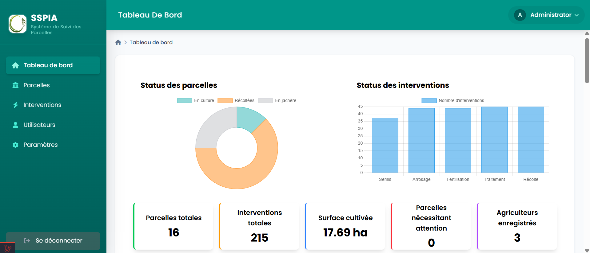
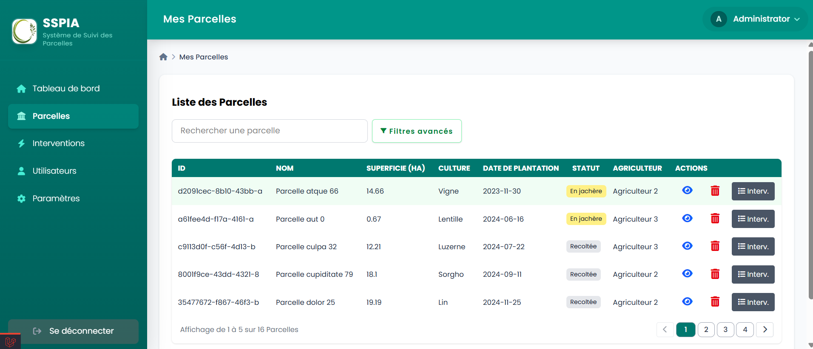
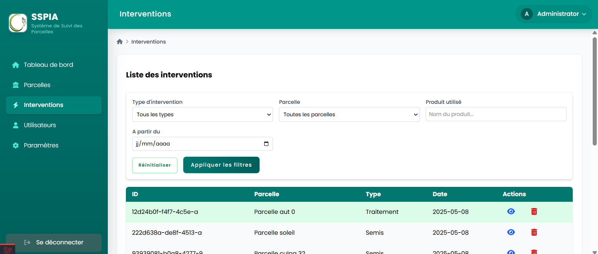
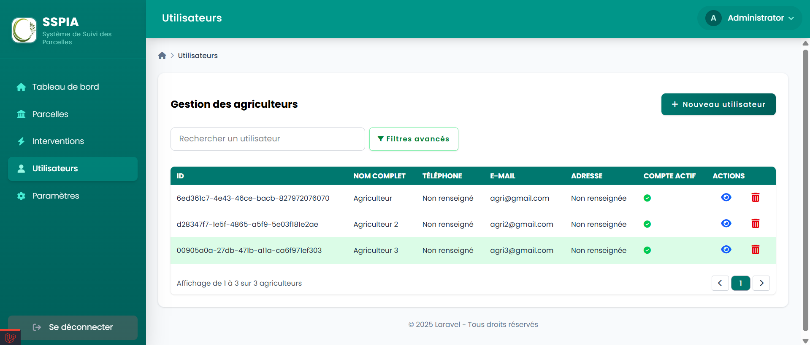

<p align="center"><a href="https://laravel.com" target="_blank"></a></p>

<p align="center">
    <strong>SSPIA_TP</strong> - Système de Suivi des Parcelles et Interventions Agricoles
</p>

---

## À propos de SSPIA_TP

SSPIA_TP est une application web développée avec le framework Laravel. Elle permet de gérer efficacement les parcelles agricoles et les interventions associées. Ce projet vise à offrir une solution complète pour les agriculteurs et les administrateurs, en mettant l'accent sur la traçabilité, la gestion des cultures et l'optimisation des interventions.

### Fonctionnalités principales

- **Gestion des parcelles** : Ajout, modification, suppression et suivi des parcelles agricoles.
- **Gestion des interventions** : Enregistrement des interventions (semis, arrosage, fertilisation, etc.) et suivi de leur historique.
- **Tableau de bord** : Visualisation des statistiques globales (parcelles, interventions, surface cultivée, etc.).
- **Rôles et permissions** : Gestion des utilisateurs avec des rôles spécifiques (administrateurs, agriculteurs).
- **Notifications** : Alertes pour les actions importantes (parcelles nécessitant une attention, interventions récentes).
- **Export PDF** : Génération d'étiquettes pour les parcelles et interventions.

---

## Installation

### Prérequis

- PHP >= 8.1
- Composer
- Node.js & npm
- MySQL ou SQLite
- Docker (optionnel, pour l'utilisation de Sail)

### Étapes d'installation

1. Clonez le dépôt :
   ```bash
   git clone https://github.com/votre-utilisateur/SSPIA_TP.git
   cd SSPIA_TP
   ```

2. Installez les dépendances PHP et JavaScript :
   ```bash
   composer install
   npm install
   ```

3. Configurez le fichier `.env` :
   ```bash
   cp .env.example .env
   php artisan key:generate
   ```

4. Configurez la base de données dans le fichier `.env` :
   ```env
   DB_CONNECTION=mysql
   DB_HOST=127.0.0.1
   DB_PORT=3306
   DB_DATABASE=sspia_tp
   DB_USERNAME=root
   DB_PASSWORD=
   ```

5. Exécutez les migrations et les seeders :
   ```bash
   php artisan migrate --seed
   ```

6. Lancez le serveur de développement :
   ```bash
   php artisan serve
   ```

7. Accédez à l'application via [http://localhost:8000](http://localhost:8000).

---

## Utilisation

### Rôles disponibles

- **Administrateur** : Gestion complète des utilisateurs, parcelles et interventions.
- **Agriculteur** : Gestion de ses propres parcelles et interventions.

### Commandes utiles

- Lancer les tests :
  ```bash
  php artisan test
  ```

- Générer les assets front-end :
  ```bash
  npm run dev
  ```

- Lancer Sail (Docker) :
  ```bash
  sail up -d
  ```

---

## Fonctionnalités techniques

### Technologies utilisées

- **Backend** : Laravel 10.x
- **Frontend** : Blade, TailwindCSS, Alpine.js
- **Base de données** : MySQL ou SQLite
- **PDF** : DomPDF pour la génération d'étiquettes
- **Tests** : PHPUnit pour les tests unitaires et fonctionnels

### Structure du projet

- `app/` : Contient les contrôleurs, modèles et services principaux.
- `resources/views/` : Fichiers Blade pour les interfaces utilisateur.
- `database/migrations/` : Définitions des tables de la base de données.
- `tests/` : Tests unitaires et fonctionnels.

---

## Interfaces principales

Voici un aperçu des interfaces principales de l'application **SSPIA_TP** :

### 1. Tableau de bord
- **Description** : Affiche un résumé des parcelles et interventions.
- **Fonctionnalités** :
  - Nombre total de parcelles.
  - Nombre total d'interventions.
  - Statistiques sur les cultures.

<p align="center">
    
</p>

### 2. Gestion des parcelles
- **Description** : Permet de gérer les parcelles agricoles.
- **Fonctionnalités** :
  - Ajouter une nouvelle parcelle.
  - Modifier les informations d'une parcelle existante.
  - Supprimer une parcelle.


<p align="center">
    
</p>


### 3. Gestion des interventions
- **Description** : Permet de gérer les interventions agricoles.
- **Fonctionnalités** :
  - Ajouter une nouvelle intervention.
  - Modifier une intervention existante.
  - Supprimer une intervention.

<p align="center">
    
</p>


### 4. Gestion des agriculteurs

- **Description** : Gérer les différents agriculteurs du système.

- **Fonctionnalités** :
  - Ajouter de nouveau Agriculteur
  - Voir les details sur les agriculteurs
  - Supprimer un agriculteur

<p align="center">
    
</p>


## Contribution

Merci de considérer contribuer à ce projet ! Veuillez suivre les étapes suivantes pour soumettre vos modifications :

1. Forkez le dépôt.
2. Créez une branche pour vos modifications :
   ```bash
   git checkout -b feature/ma-fonctionnalite
   ```
3. Soumettez une pull request.

---

## Sécurité

Si vous découvrez une vulnérabilité de sécurité, veuillez envoyer un e-mail à l'un des contributeurs
---

## Licence

Ce projet est un logiciel open-source sous licence [MIT](https://opensource.org/licenses/MIT).

---

## Quelques interfaces

<p align="center">© {{ date('Y') }} SSPIA_TP - Tous droits réservés.</p>
